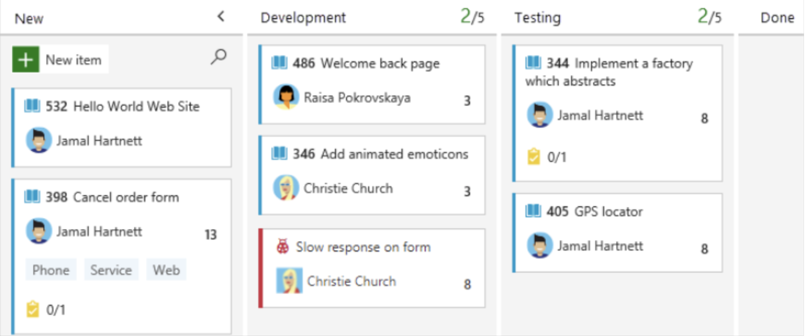

# PART A: Vibe Coding to create a Kanban Board

Switch to Plan Mode and ask the following question:

```Please create a kanban board style project planner for me using Nodejs stack```

**Planning questions**

**1. What architecture do you want for the kanban board?**
Full-stack app (Node.js backend + React frontend)
- Complete application with REST API and modern UI

**2. Which database would you prefer?**
SQLite
- Local file-based database, no server needed

**3. What features do you want in the kanban board?**
Drag-and-drop cards
- Move cards between columns, Card details (description, due date, tags) - Rich card information

**4. What's your priority for this project?**
Quick prototype
- Get something working fast, can refine later

Then please click on "Start Implementation".

Lets refine the user interface and change model to gemini-3 Pro (preview) and type:

```Please make user interface look like this```



Lastly type:

```
Generate system design document and use mermaid to generate markdown file
```

# PART B: Custom Skills & Agent Exercise
https://github.com/edsml-kl121/github_custom_skills_agents

# PART C: MCP & Copilot & agents in github.com
https://github.com/edsml-kl121/exercise-integrate-mcp-with-copilot
